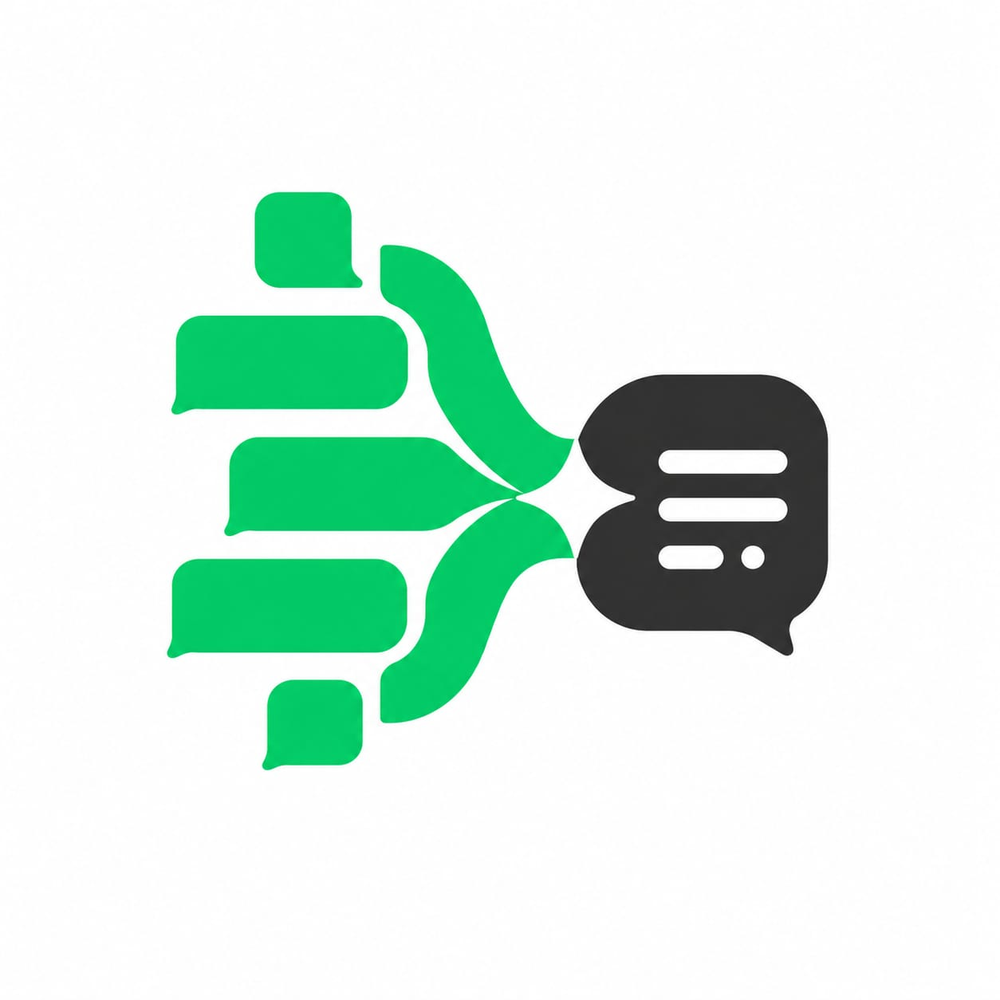

# WhatsApp Group Summary Bot for Hermes Agent



Bot ringkasan grup WhatsApp — merekam semua chat anggota grup secara diam-diam dan mengirim ringkasan terstruktur 2x sehari (07:00 & 23:00 WIB).

## Fitur

- 📝 **Rekam semua chat** — semua pesan dari seluruh anggota grup direkam ke JSONL, bahkan dari non-whitelist
- 🤫 **Silent recording** — bot tidak merespon chat biasa, hanya merespon saat di-@mention
- 📊 **Ringkasan 2x sehari** — pagi (07:00) & malam (23:00) dengan format terstruktur
- 🔥 **Mode Roast** (opsional) — versi sarkas/lucu dari ringkasan
- 🇮🇩 **Bahasa Indonesia santai** — gaya casual, bukan formal

## Format Ringkasan

```
*Summary General — 12 jam terakhir*
- *Inti Diskusi*
- Ngobrolin tools AI: GPT 5.6 Sol, Codex, Claude vs ChatGPT 5
- Sharing repo token saver: oh-my-pi dan paleo
- *Keputusan*
- Tidak ada keputusan formal.
- *Follow-up / Action*
- Pen?: cek detail deploy error
- *Pertanyaan Terbuka*
- API Gmaps berbayar atau gratis?
- *Link-link*
- Nado: token saver — github.com/Fernado03/oh-my-pi-supreme-token-saver
```

## Instalasi

### Prasyarat

- Hermes Agent terinstall dan gateway WhatsApp berjalan
- Akses SSH/terminal ke server Hermes
- Hermes sudah di-invite ke grup WhatsApp yang ingin di-summary

### Langkah 1: Clone skill

```bash
mkdir -p ~/.hermes/skills
git clone https://github.com/mocasus/whatsapp-group-summary.git ~/.hermes/skills/whatsapp-group-summary-bot
```

### Langkah 2: Patch source files

Tiga file source Hermes perlu dipatch agar semua chat grup direkam (default-nya WhatsApp hanya meneruskan pesan dari user whitelist atau @mention).

> ⚠️ Patch akan hilang setiap kali `hermes update`. Simpan repo ini dan re-apply setelah update.

#### Patch A: Bridge JS

File: `~/.hermes/hermes-agent/scripts/whatsapp-bridge/bridge.js` ~line 637

**Cari:**
```js
if (WHATSAPP_DM_POLICY !== 'pairing' && !matchesAllowedUser(senderId, ALLOWED_USERS, SESSION_DIR)) {
```

**Ganti dengan (tambah `!isGroup &&`):**
```js
if (!isGroup && WHATSAPP_DM_POLICY !== 'pairing' && !matchesAllowedUser(senderId, ALLOWED_USERS, SESSION_DIR)) {
```

#### Patch B: Adapter Logic

File: `~/.hermes/hermes-agent/gateway/platforms/whatsapp_common.py` ~lines 361-365

**Cari:**
```python
            # Only respond to whitelisted senders in groups
            if self._allow_from:
                sender_id = str(data.get("senderId") or ...)
                if sender_id and not self._matches_whatsapp_allowlist(...):
                    return False
```

**Ganti dengan:**
```python
            # NOTE: patched — allowlist check skipped for groups
            # Only DMs are gated by WHATSAPP_ALLOWED_USERS.
```

#### Patch C: Silent Recorder

File: `~/.hermes/hermes-agent/plugins/platforms/whatsapp/adapter.py`

**Tambahkan method** sebelum `_build_message_event`:
```python
    def _record_group_message_sync(self, data):
        try:
            import json, os
            chat_id = str(data.get("chatId") or "")
            if not chat_id.endswith("@g.us"): return
            body = str(data.get("body") or "").strip()
            if not body: return
            log_dir = os.path.expanduser("~/.hermes/platforms/whatsapp/group_logs")
            os.makedirs(log_dir, exist_ok=True)
            entry = {
                "ts": data.get("timestamp", 0),
                "sender": str(data.get("senderName") or data.get("senderId") or ""),
                "body": body,
            }
            with open(os.path.join(log_dir, f"{chat_id}.jsonl"), "a") as f:
                f.write(json.dumps(entry, ensure_ascii=False) + "\n")
        except Exception:
            pass
```

**Di dalam `_build_message_event`**, tambahkan sebelum `_should_process_message`:
```python
            if data.get("isGroup", False):
                self._record_group_message_sync(data)
```

### Langkah 3: Set environment variable

Tambahkan ke `~/.hermes/.env`:
```bash
WHATSAPP_REQUIRE_MENTION=true
```

### Langkah 4: Restart gateway

```bash
hermes gateway restart
```

> Jika restart dari dalam gateway diblokir, jalankan dari terminal SSH terpisah.

### Langkah 5: Verifikasi recording

Kirim pesan test di grup WhatsApp, lalu cek:
```bash
ls ~/.hermes/platforms/whatsapp/group_logs/
cat ~/.hermes/platforms/whatsapp/group_logs/<chat_id>@g.us.jsonl
```

### Langkah 6: Setup cron jobs

Dapatkan ID grup dengan tag Hermes di grup: "apa id grup ini?"

Lalu setup 2 cron job via Hermes:

**Morning (07:00 WIB):**
```
Schedule: 0 0 * * *
Deliver: whatsapp:<chat_id>@g.us
```

**Evening (23:00 WIB):**
```
Schedule: 0 16 * * *
Deliver: whatsapp:<chat_id>@g.us
```

**Prompt:**
```
Kamu adalah bot ringkasan. HANYA OUTPUT RINGKASAN. Baca ~/.hermes/platforms/whatsapp/group_logs/<CHAT_ID>.jsonl, filter 12 jam (ts=UNIX timestamp). TANPA blank line:

*Summary General — 12 jam terakhir*
- *Inti Diskusi*
- [rangkum per topik]
- *Keputusan*
- [keputusan]
- *Follow-up / Action*
- [Nama]: [action]
- *Pertanyaan Terbuka*
- [pertanyaan]
- *Link-link*
- [Nama]: [desc] — [URL]

ATURAN: No metadata, no blank line, no job info. HANYA ringkasan.
```

## Mode Roast 🔥

Untuk mengaktifkan mode roast (sarkas/lucu), update prompt cron job:

```
Kamu adalah bot ringkasan versi ROAST. Gaya: sarkas, lucu, roasting tapi friendly.

*Summary Roast — 12 jam terakhir 🔥*
- *Yang Paling Nyablak*
- [siapa paling rame + roast ringan]
- *Drama & Perdebatan*
- [topik panas + komentar sarkas]
- *Receh Tapi Menghibur*
- [chat random lucu/absurd]
- *Keputusan (yg akhirnya diambil setelah debat panjang)*
- [keputusan]
- *PR Yang Belum Kelar*
- [Nama]: [action + roast]
- *Pertanyaan Nyangkut*
- [pertanyaan]
- *Link Berserakan*
- [Nama]: [desc] — [URL]
```

## Troubleshooting

| Masalah | Solusi |
|---------|--------|
| Recording ga muncul | Cek `ls ~/.hermes/platforms/whatsapp/group_logs/` — kalau kosong, pastikan patch A-C sudah applied dan gateway sudah restart |
| Cron output ada "Cronjob Response..." | Itu dari sistem delivery Hermes, hanya muncul di DM. Delivery ke grup WhatsApp langsung clean |
| Patch hilang setelah update | Re-apply patch A-C setiap kali `hermes update` |
| Gateway restart diblokir | Jalankan dari terminal SSH terpisah, bukan dari dalam session Hermes |
| Blank lines di output | Pastikan prompt cron job ada "TANPA blank line" |

## License

MIT
